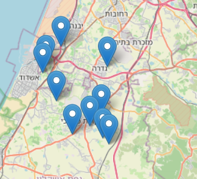
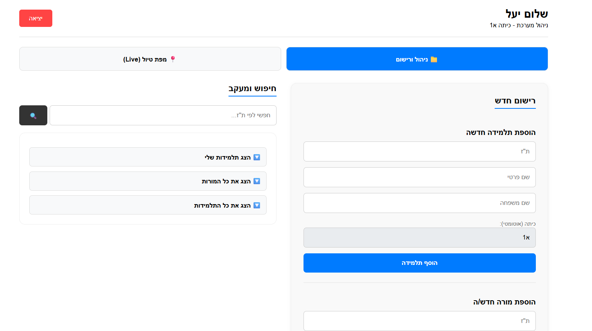

# 🌍 Hadasim Travel - School Trip Management System

מערכת לניהול ואיכון תלמידות בזמן אמת, שפותחה במסגרת תרגיל בית לתוכנית הדסים.

---

## 📋 תיאור הפרויקט
המערכת נועדה לסייע למורות בניהול טיול שנתי.  
היא מאפשרת:

- ניהול תלמידות ומורות
- שליפת מידע דרך API
- צפייה במיקומי תלמידות בזמן אמת על גבי מפה

המערכת מבוססת על ארכיטקטורת Client-Server ומורכבת מ־Backend ו־Frontend.

---

## 🚀 הרצה והתקנה (Docker)

המערכת ניתנת להרצה מלאה באמצעות Docker Compose, ללא צורך בהתקנות מקומיות של מסד נתונים או סביבות ריצה.

### דרישות קדם
- Docker Desktop
- Git

---

### ▶️ שלבי הרצה

```bash
git clone https://github.com/YOUR_USERNAME/hadasim-travel-system.git
cd hadasim-travel-system
docker-compose up --build
```

---

### ▶️ גישה למערכת 


Frontend: http://localhost:5173
Backend (Swagger): http://localhost:8000/docs

API עיקרי
Authentication
POST /auth/login
POST /auth/logout
Students
GET /students/
GET /students/{id}
GET /students/my-class
POST /students/
Teachers
GET /teachers/
GET /teachers/{id}
POST /teachers/ 
Locations
POST /locations/update Update Location
GET /locations/{student_tz}/last-location
GET /locations/{student_tz}/path
GET /locations/class-last-locations

### הרשאות
רק מורה יכולה לגשת ל־API
מורה יכולה לצפות רק בתלמידות מהכיתה שלה

### 📸 צילומי מסך
<p align="center">
  
  
  

</p>

---

###  טכנלוגיות ושפות 

Backend: FastAPI (Python) - שרת מהיר, אסינכרוני וקל לתיעוד.

Frontend: React + Vite - ממשק משתמש מודרני, תגובתי ומהיר.

Database: PostgreSQL - מסד נתונים רלציוני חזק לאחסון מידע מובנה ומיקומים.

Containerization: Docker & Docker Compose - לניהול תשתיות אחיד.

Maps: Leaflet / React-Leaflet - להצגת נתונים גאוגרפיים בזמן אמת.
docker-compose.yml: הגדרות התזמור והקישוריות בין ה-Frontend, ה-Backend וה-Database.


### 📦 מבנה הפרויקט
/backend – שרת ה־API
/frontend – צד לקוח
docker-compose.yml – הגדרת שירותים