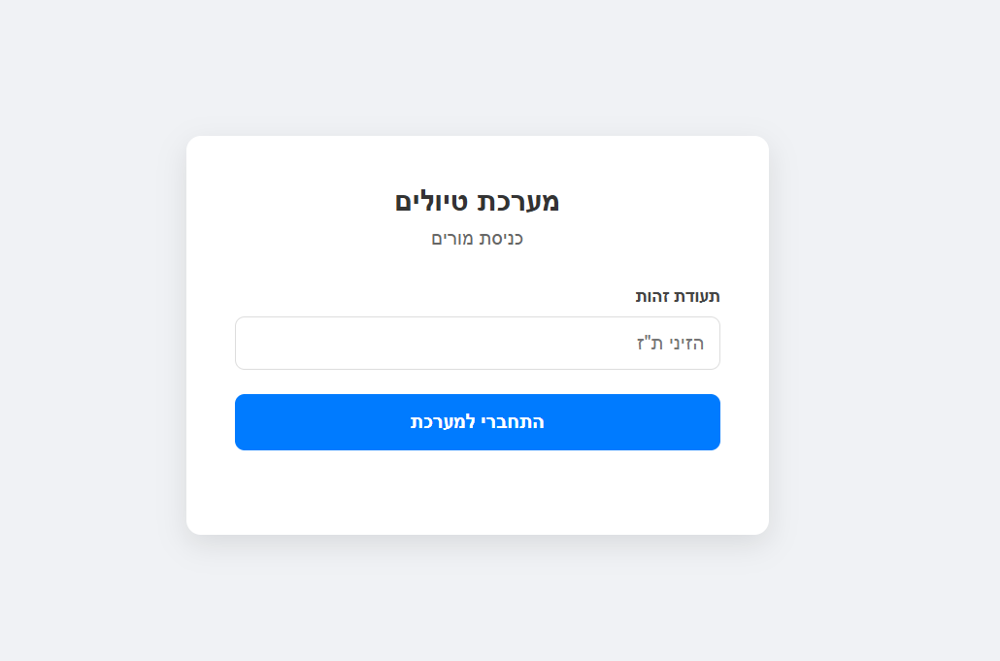

# 🌍 Hadasim Travel - Student Location System

מערכת לניהול ואיכון תלמידות בזמן אמת, שפותחה כפרויקט גמר המשלב עבודה עם טכנולוגיות Backend ו-Frontend מתקדמות בסביבת Docker.

## 📋 אודות הפרויקט
המערכת נועדה לספק פתרון טכנולוגי לניהול טיולים בית-ספריים. היא מאפשרת למורות לעקוב אחר מיקומי התלמידות על גבי מפה אינטראקטיבית, לקבל עדכונים שוטפים ממכשירי קצה ולנהל את רשימת התלמידות והכיתות.

---

## 📸 צילומי מסך
<p align="center">
  
  
</p>

---

## 🚀 הוראות התקנה והרצה (Docker)
הפרויקט מבוסס על Docker Compose, מה שמאפשר הרצה מהירה ללא צורך בהתקנות מקומיות של מסדי נתונים או סביבות ריצה.

### דרישות קדם
* Docker Desktop מותקן ופועל.
* Git.

### שלבי הרצה
1. **שכפול הפרויקט:**
   ```bash
   git clone [https://github.com/YOUR_USERNAME/hadasim-travel-system.git](https://github.com/YOUR_USERNAME/hadasim-travel-system.git)
   cd hadasim-travel-system


   בנייה והרצה של השירותים:

Bash
docker-compose up --build
גישה למערכת:

ממשק המשתמש (Frontend): http://localhost:5173

תיעוד ה-API (Swagger): http://localhost:8000/docs

🛠 טכנולוגיות בשימוש
Backend: FastAPI (Python) - שרת מהיר, אסינכרוני וקל לתיעוד.

Frontend: React + Vite - ממשק משתמש מודרני, תגובתי ומהיר.

Database: PostgreSQL - מסד נתונים רלציוני חזק לאחסון מידע מובנה ומיקומים.

Containerization: Docker & Docker Compose - לניהול תשתיות אחיד.

Maps: Leaflet / React-Leaflet - להצגת נתונים גאוגרפיים בזמן אמת.

📡 סימולציית מכשירי קצה (GPS Simulator)
כדי לבחון את המערכת עם נתונים חיים, מצורף סקריפט סימולציה בתיקיית ה-backend המדמה מכשירי איכון השולחים נתוני מיקום בכל דקה.

הרצת הסימולטור:

ודאו שהמכולות של דוקר פועלות.

פתחו טרמינל חדש והריצו:

Bash
# כניסה לתיקיית הבאקנד (או הרצה מהשורש עם הנתיב המלא)
python backend/seed_data.py
הסקריפט שולח בקשות POST בפורמט JSON הכולל קואורדינטות DMS (Degrees, Minutes, Seconds) וזמן שליחה מדויק.

📝 הנחות מקלות (Assumptions)
CORS Policy: לצורכי פיתוח והדגמה נוחים, ה-CORS מוגדר כפתוח (*) כדי לאפשר תקשורת חלקה בין ה-Frontend ל-Backend בסביבת ה-Containers.

המרת קואורדינטות: השרת מבצע המרה מתמטית מפורמט DMS לפורמט עשרוני (Decimal Degrees) בהנחה שהקואורדינטות הן בטווח הגאוגרפי של ישראל.

אבטחה: מנגנון ה-JWT מיושם לצורך זיהוי מורה, אך לצורך הפשטות בתרגיל זה, הרישום פתוח ללא צורך באימות סיסמאות מורכב במיוחד.

📂 מבנה הפרויקט
/backend: שרת ה-API, מודלים של ה-Database, וסקריפטים להזרקת נתונים (Seeding).

/frontend: קוד ה-React, רכיבי המפה, עיצוב ה-UI וניהול ה-State.

docker-compose.yml: הגדרות התזמור והקישוריות בין ה-Frontend, ה-Backend וה-Database.